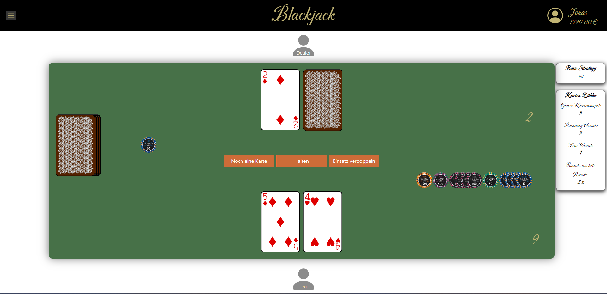

# Blackjack

Implementierung des Kartenspiels Blackjack mit Vorschlag-System für die optimale Strategie.

+ Dependencies installieren mit `npm install`
+ Starten mit `npm start`
+ Tests laufen lassen mit `npm test`

# Spielablauf
+ Zuerst muss ein Profil angelegt werden, dafür muss nur ein Name eingegeben werden
+ Dann kann ein neues Spiel gestartet werden
+ Hier muss zuerst der Einsatz festgelegt werden, durch Drücken auf OK beginnt die Runde
+ Die Buttons in der Mitte des Spielfeldes zeigen die Aktionsmöglichkeiten des Spielers an
+ Im Menü, das durch Drücken auf den Menübutton am linken oberen Rand geöffnet werden kann, kann der Spieler einstellen, welche Strategie Hilfestellungen er erhalten will.
+ Die Strategie Hilfestellungen werden am rechten Rand angezeigt.
  + Dabei gibt Basic Strategy an, welche Aktion der Spieler nach der optimalen Strategie ausführen sollte
    + Hit: Noch eine Karte
    + Stand: Halten
    + Split: Karten Splitten
    + Double: Einsatz verdoppeln
  + Karten Zählen gibt an, wie viel Einsatz ausgehend von seinem Basiseinsatz der Spieler optimalerweise in der nächsten Runde setzten sollte.

